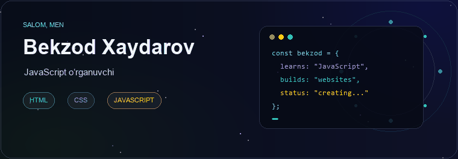
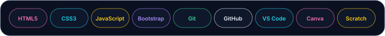
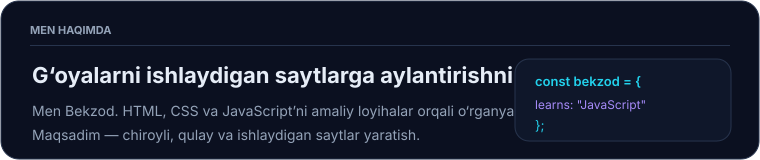
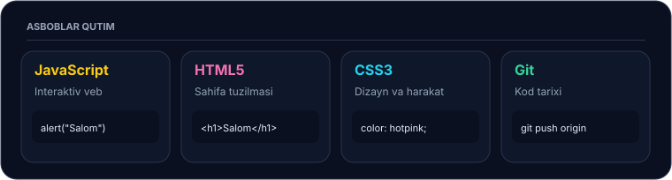
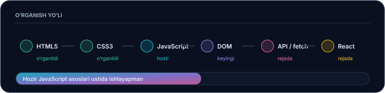
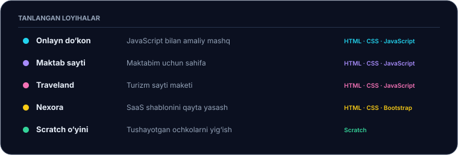
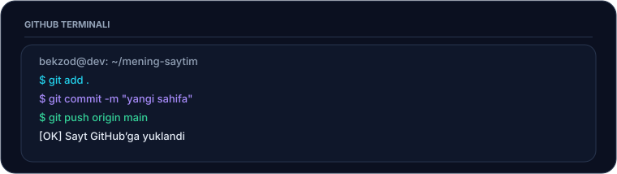
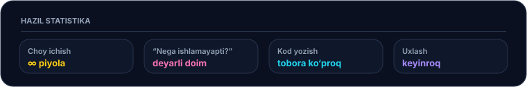

  
    
  

## 👋 Men haqimda

Men **Bekzod Xaydarovman**. Hozir frontend dasturlashni amaliy mashqlar va kichik loyihalar orqali o‘rganyapman. Har bir yangi sahifa — HTML tuzilmasini yaxshiroq tushunish, CSS bilan ko‘rinishni yaxshilash va JavaScript orqali interaktivlik qo‘shish uchun imkoniyat.

  

## 🧰 Asboblar qutim

  

| Texnologiya | Hozirgi yo‘nalishim |
|---|---|
| **HTML5** | Sahifaning mazmunli va tartibli tuzilmasi |
| **CSS3** | Ranglar, joylashuv, moslashuvchan dizayn va harakatlar |
| **JavaScript** | Asosiy sintaksis va sahifaga interaktivlik qo‘shish |
| **Bootstrap** | Tayyor komponentlar bilan tez maket tuzish |
| **Git & GitHub** | O‘zgarishlarni saqlash va loyihalarni ulashish |
| **VS Code** | Kod yozish va loyihalarni boshqarish |

## 🗺️ O‘rganish yo‘lim

  

- ✅ HTML asoslari
- ✅ CSS asoslari
- 🔄 JavaScript asoslari — hozirgi diqqat markazim
- ⏭️ DOM bilan ishlash
- 📌 API va `fetch`
- 📌 React

## 💻 Loyihalarim

Quyidagi ishlarim o‘rganish jarayonidagi amaliy loyihalar. Har bir loyiha havolasini GitHub username’ingiz va repository nomingiz bilan almashtiring.

  

### 🛍️ Onlayn do‘kon
JavaScript yordamida veb-sahifa yaratish va interaktiv elementlarni mashq qilish uchun loyiha.

**Texnologiyalar:** HTML · CSS · JavaScript  
🔗 [Repositoryni ko‘rish](https://github.com/USERNAME/ONLINE-STORE-REPOSITORY)

### 🏫 Maktab sayti
Maktabim yoki sinfim uchun tayyorlagan sahifa. Loyihada HTML, CSS va JavaScript’dan foydalandim.

**Texnologiyalar:** HTML · CSS · JavaScript  
🔗 [Repositoryni ko‘rish](https://github.com/USERNAME/SCHOOL-SITE-REPOSITORY)

### 🌍 Traveland turizm sayti
Turizm agentligi mavzusidagi maket asosida tuzilgan veb-sayt.

**Texnologiyalar:** HTML · CSS · JavaScript  
🔗 [Repositoryni ko‘rish](https://github.com/USERNAME/TRAVELAND-REPOSITORY)

### ✨ Nexora shabloni
SaaS sahifasini qayta yasash orqali layout va Bootstrap bilan ishlashni mashq qildim.

**Texnologiyalar:** HTML · CSS · Bootstrap  
🔗 [Repositoryni ko‘rish](https://github.com/USERNAME/NEXORA-REPOSITORY)

### 🎮 Scratch o‘yini
Tushayotgan ochkolarni yig‘ishga asoslangan kichik o‘yin.

**Texnologiya:** Scratch  
🔗 [Loyihani ko‘rish](https://github.com/USERNAME/SCRATCH-GAME-REPOSITORY)

## ⚙️ Ish jarayonim

  

Odatda yangi loyihani quyidagi bosqichlarda bajaraman:

1. G‘oyani kichik vazifalarga ajrataman.
2. HTML bilan sahifa tuzilmasini yarataman.
3. CSS orqali ko‘rinishini sozlayman.
4. JavaScript bilan kerakli interaktivlikni qo‘shaman.
5. O‘zgarishlarni Git orqali saqlab, GitHub’ga joylayman.

## 🌱 Hozirgi maqsadlarim

- JavaScript asoslarini mustahkamlash
- DOM orqali sahifadagi elementlarni boshqarishni o‘rganish
- Telefon va kompyuterda qulay ko‘rinadigan sahifalar yaratish
- O‘rganganlarimni yangi loyihalarda qo‘llash
- GitHub’dagi portfolio’ni muntazam yangilab borish

## 🎈 Kod yozish kayfiyati

  

> Har bir xato — keyingi safar nimani boshqacha qilishni o‘rgatadigan kichik dars. ☕

## 📫 Bog‘lanish

  
  
  
  

---

  

  ✨ O‘rganishda davom etaman, kod yozaman va yangi g‘oyalarni sinab ko‘raman.

